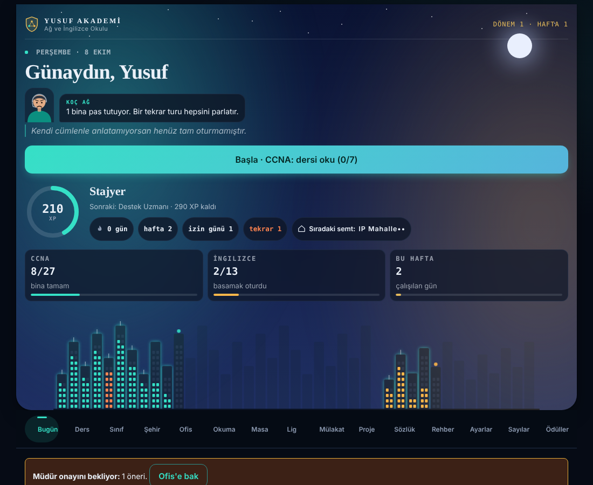
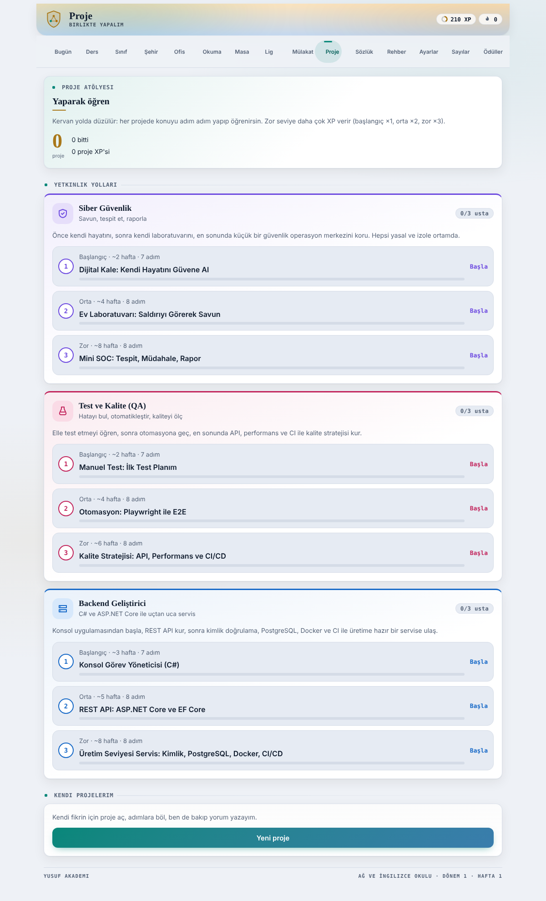
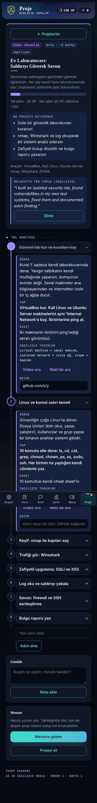

# Proofpath

Yedi derslik, oyunlaştırılmış kişisel öğrenme uygulaması: **CCNA, Network, İngilizce, Siber güvenlik, Backend, DevOps, Test Uzmanı**. Tek dosyalık bir Claude Artifact'tır (`index.html`); günlük dersleri zamanlanmış "koç" görevleri üretir, veriler artifact veritabanında tutulur.



## Neler var

- **Bugün**: günün dersi, kısa kontrol soruları, seri ve XP.
- **Dersler**: her ders için ısınma, anlatım ve dersin kendi içeriğinden kurulan mini sınav.
- **Animasyon Atölyesi**: 70 kurgulu sahneyle ağ, güvenlik, DevOps, test ve backend kavramlarının adım adım hareketli anlatımı.
- **Kavram Atlası, Ders Notları ve Seviye sınavı**: yedi dersin hepsi için.
- **Oyunlar**: Ağ Koşusu, Fetih ve günlük "Günün meydanı".
- **Lig**: her gün 8 soru (+ yanlış yapılanlardan en fazla 2 tekrar). Yanlışta kartın arkası doğru cevabı ve nedenini gösterir.
- **Proje Atölyesi**: kendi projelerin ve 9 hazır *Yetkinlik Yolu* (siber güvenlik, test/QA, backend; her biri başlangıç, orta, zor). Her adımda Öğren, Yap, Kanıt, İngilizce terimler ve arama sorgusu bulunur.
- **Sınav Haritası** ve **Mülakat Antrenmanı**.
- **Sözlük** ve **Rehber**: ders terimlerinin sade açıklamaları.
- **Rahat okuma ve Sade mod** (Ayarlar): büyük yazı, yüksek kontrast, az sayıda düğme.

| Yetkinlik Yolları | Proje yol haritası |
|---|---|
|  |  |

## Mimari

- Ön yüz: tek dosya, bağımlılıksız HTML/CSS/JS (`index.html`). Açık ve koyu tema, telefon genişliği desteklenir.
- Veri: Claude Artifact `db` yeteneği. Koleksiyonlar için [docs/VERI_SEMASI.md](docs/VERI_SEMASI.md).
- Üretim: derslere göre günlük koç görevleri ve haftalık Müdür görevi dersleri, biletleri ve raporları veritabanına yazar. Koç komutları `content/coach/`, animasyon sahneleri `content/nwscenes/` altında. Öğretim kuralları için [docs/OGRETIM_ILKELERI.md](docs/OGRETIM_ILKELERI.md).
- Tasarım kararları: [docs/UX_ANALIZ.md](docs/UX_ANALIZ.md).

> `index.html` içindeki `window.claude` çağrıları Claude Artifact ortamında çalışır. Normal bir tarayıcıda açarsan veri kaydı çalışmaz; arayüzü görmek için `tests/stub.js` içindeki sahte ortam kullanılır.

## Test

```bash
npm install playwright
node tests/smoke.js
```

Duman testi 15 sekmeyi 400 px koyu ve 1100 px açık temada açar; sayfa hatası ve yatay taşma arar.

Mobil taraması: `node tests/mobil.js` (3 telefon boyutu × yazı/sade/kontrast ayarları × 15 sekme).

## Bilinen sınırlar

- 172 soru, 3 bağımsız yapay zekâ incelemesinden geçti (yanlış cevap bulunmadı, 8 ifade düzeltildi); yine de insan uzman gözden geçirmedi, resmî CCNA kaynaklarıyla karşılaştır.
- Testler sahte `window.claude` ve emüle edilmiş telefonla yapıldı, gerçek cihaz testi yok.

## Evdeki bilgisayarda çalışırken (kesintisiz senkron)

Ana dal `main`. Her özellik ayrı commit olarak buraya gelir.

- Çalışmaya başlamadan önce: `git pull origin main`
- İş bitince: `git add -A && git commit -m "kısa not" && git push origin main`
- Çakışma olursa önce `git pull --rebase origin main`; tek dosya (`index.html`) olduğu için çakışmayı satır bazında çöz.
- Sıfırdan kurulum: `git clone <repo-adresi>` sonra `index.html` dosyasını tarayıcıda aç.
- Testler `tests/` altında (Playwright); `stub.js` sahte veri katmanıdır.
